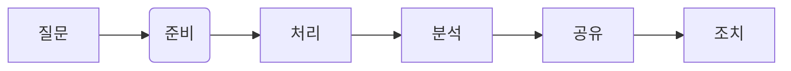

> [!NOTICE]
> - 🖊 공지: 이 포스트는 Google Career Certificates Data Analytics 수료증 과정을 토대로 작성됨
> - 🚩 URL: https://www.coursera.org/programs/gdsc-daejeondaehaggyo-gcc-study-8pfag/professional-certificates/google-data-analytics-korean?collectionId=RFQSv

# 💻 Data = 정보의 모음 (혹은 집합)
- 정보의 모음에는 숫자, 사진, 동영상, 단어, 측정 항목, 관측값 등이 포함된다.
- 시간이 지남에 따라 진화한다.
- 누구나 데이터를 사용함과 동시에, 데이터를 생성하고 있다.
	- 휴대전화를 사용하여 온라인에 검색, 음악을 스트리밍, 신용 카드로 쇼핑 등의 활동이 데이터를 생성
- Google에서는 매초 4만건, 하루에는 35억 건, 매년 1조 2천억 건이 넘는 검색어를 처리한다.

#  🔍 Analytics = 데이터 분석
- **결론을 도출 및 예측**하고 정보에 기반한 **의사 결정을 내리기 위한 모든 작업**들을 통칭한다.
- 데이터를 **수집, 변환, 구성하는 작업**이 대표적이다.
- 전체 라이프 사이클에 걸쳐 새로운 정보를 찾아낼 수 있다.
- 대표적인 예시로 제품의 구매 여부를 결정하기 전에 읽게 되는 **제품의 리뷰**들이 있다.

# 📊 Data Analyst
- 정보에 기반한 의사 결정을 내릴 수 있도록 데이터를 수집 및 변환, 구성하는 역할을 수행한다.

# 📅 Data Analytics Course

1. 기초: 어디에나 존재하는 데이터
2. 데이터 기반 의사 결정을 위한 질문
3. 탐색을 위한 데이터 준비
4. 데이터 정리
5. 데이터 분석을 통한 해답 찾기
6. 시각화를 통한 데이터 공유
7. R 프로그래밍을 사용한 데이터 분석
8. Google 데이터 애널리틱스 캡스톤: 사례 연구 활동

# 📝 Cleaning Data
- 데이터 정리야말로 분석에 있어서, 가장 중요한 핵심 중 하나이다.
- 특이점과 결함, 미스터리한 부분에 대해서 더 이해하게 될 수 있다.
- 데이터를 정리할 때는 데이터의 완전성, 정확성, 해결하려는 문제와 관련성을 확인한다.

## 1‍⃣ 기초: 어디에나 존재하는 데이터

### ☑ Contents

1. **데이터 애널리틱스 개론**
- 데이터는 비즈니스뿐만 아니라 일상생활에서 결정을 내리는 데 도움이 됨
- 데이터 애널리스트가 관련 도구를 사용하여 의사 결정에 도움이 되는 정보를 제공하는 방법을 학습

2. **분석적 사고** 
- 데이터 애널리스트는 업무에서 다양한 역할을 균형 있게 수행
- 분석적 사고란 무엇인지 알아보고 분석적 사고와 데이터 기반 의사결정과의 관련성에 관해서 학습

3. **놀라운 데이터의 세계 탐구** 
- 데이터에는 자체 라이프 사이클이 있으며, 데이터 애널리스트는 이 라이프 사이클 전반에서 분석 과정을 활용
- 데이터 분석 과정을 통해 데이터를 처리하는 데 도움이 되는 애플리케이션을 배움

4. **데이터 도구 상자 설정** 
- 스프레드시트, 쿼리 언어, 데이터 시각화 도구는 모두 데이터 애널리스트 업무에서 큰 부분을 차지함
- 예시를 통해 도구의 작동 방식 이해

5. **데이터 커리어 가능성 발견** 
- 모든 비즈니스에서 데이터 애널리스트의 역할을 높이 평가
- 또데이터 애널리스트의 직무 요건을 충족하는 데, Google 데이터 애널리틱스 수료증이 어떤 도움이 되는지 확인

6. **강좌 챌린지 완료** 
- 강좌의 마무리 단계에서 강좌 챌린지를 통해 지금까지 학습한 내용을 훑어볼 수 있음
- 강좌 챌린지에서는 학습한 핵심 개념에 관한 질문이 두 가지 시나리오를 통해 제시되며, 핵심 개념을 적용하여 질문에 답하는 형식으로 진행

