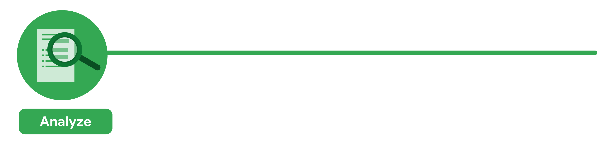

> [!NOTICE]
> - 🖊 공지: 이 포스트는 Google Career Certificates Data Analytics 수료증 과정을 토대로 작성됨
> - 🚩 URL: https://www.coursera.org/programs/gdsc-daejeondaehaggyo-gcc-study-8pfag/professional-certificates/google-data-analytics-korean?collectionId=RFQSv

# 💻 Data = 정보의 모음 (혹은 집합)
- 정보의 모음에는 숫자, 사진, 동영상, 단어, 측정 항목, 관측값 등이 포함된다.
- 시간이 지남에 따라 진화한다.
- 누구나 데이터를 사용함과 동시에, 데이터를 생성하고 있다.
	- 휴대전화를 사용하여 온라인에 검색, 음악을 스트리밍, 신용 카드로 쇼핑 등의 활동이 데이터를 생성
- Google에서는 매초 4만건, 하루에는 35억 건, 매년 1조 2천억 건이 넘는 검색어를 처리한다.

#  🔍 Analytics = 데이터 분석
- **결론을 도출 및 예측**하고 정보에 기반한 **의사 결정을 내리기 위한 모든 작업**들을 통칭한다.
- 데이터를 **수집, 변환, 구성하는 작업**이 대표적이다.
- 전체 라이프 사이클에 걸쳐 새로운 정보를 찾아낼 수 있다.
- 대표적인 예시로 제품의 구매 여부를 결정하기 전에 읽게 되는 **제품의 리뷰**들이 있다.

# 📊 Data Analyst
- 정보에 기반한 의사 결정을 내릴 수 있도록 데이터를 수집 및 변환, 구성하는 역할을 수행한다.

# 📅 Data Analytics Course

1. 기초: 어디에나 존재하는 데이터
2. 데이터 기반 의사 결정을 위한 질문
3. 탐색을 위한 데이터 준비
4. 데이터 정리
5. 데이터 분석을 통한 해답 찾기
6. 시각화를 통한 데이터 공유
7. R 프로그래밍을 사용한 데이터 분석
8. Google 데이터 애널리틱스 캡스톤: 사례 연구 활동

# 📝 Cleaning Data
- 데이터 정리야말로 분석에 있어서, 가장 중요한 핵심 중 하나이다.
- 특이점과 결함, 미스터리한 부분에 대해서 더 이해하게 될 수 있다.
- 데이터를 정리할 때는 데이터의 완전성, 정확성, 해결하려는 문제와 관련성을 확인한다.

## 1‍⃣ 기초: 어디에나 존재하는 데이터

### ☑ Contents

1. **데이터 애널리틱스 개론**
- 데이터는 비즈니스뿐만 아니라 일상생활에서 결정을 내리는 데 도움이 됨
- 데이터 애널리스트가 관련 도구를 사용하여 의사 결정에 도움이 되는 정보를 제공하는 방법을 학습

2. **분석적 사고** 
- 데이터 애널리스트는 업무에서 다양한 역할을 균형 있게 수행
- 분석적 사고란 무엇인지 알아보고 분석적 사고와 데이터 기반 의사결정과의 관련성에 관해서 학습

3. **놀라운 데이터의 세계 탐구** 
- 데이터에는 자체 라이프 사이클이 있으며, 데이터 애널리스트는 이 라이프 사이클 전반에서 분석 과정을 활용
- 데이터 분석 과정을 통해 데이터를 처리하는 데 도움이 되는 애플리케이션을 배움

4. **데이터 도구 상자 설정** 
- 스프레드시트, 쿼리 언어, 데이터 시각화 도구는 모두 데이터 애널리스트 업무에서 큰 부분을 차지함
- 예시를 통해 도구의 작동 방식 이해

5. **데이터 커리어 가능성 발견** 
- 모든 비즈니스에서 데이터 애널리스트의 역할을 높이 평가
- 또데이터 애널리스트의 직무 요건을 충족하는 데, Google 데이터 애널리틱스 수료증이 어떤 도움이 되는지 확인

6. **강좌 챌린지 완료** 
- 강좌의 마무리 단계에서 강좌 챌린지를 통해 지금까지 학습한 내용을 훑어볼 수 있음
- 강좌 챌린지에서는 학습한 핵심 개념에 관한 질문이 두 가지 시나리오를 통해 제시되며, 핵심 개념을 적용하여 질문에 답하는 형식으로 진행

### ☑ Data Analytics in Everyday Life
- 데이터를 통해 일상 속에서 많은 기회를 얻게 된다는 사실을 알 수 있음
- 이 세상에는 엄청난 양의 데이터가 존재함과 동시에 매일, 매시간, 매분 더 많은 데이터가 생성되고 있음
- 비즈니스 경쟁에서 승리하기 위해선 데이터를 처리는 선택이 아닌 필수
- 따라서 비즈니스에서는 매일 수집되는 데이터를 관리하고 그 의미를 파악하여 결론에 도출 및 예측할 수 있는 Data Analyst를 고용함

#### 👨‍💻 Data Analyst의 주요 업무
- 데이터에서 유용한 정보를 얻은 후, 공유와 함께 결정을 내리고 비즈니스에 조치를 취한다.
- 기업이 업무를 완전히 재고하게 하거나 새로운 방향을 제시하기도 한다.
- 예시로 데이터를 통해 신제품 출시 및 독자적인 서비스를 구상하여 놀라운 고객 경험을 제공하는 새로운 방법 모색으로 이어지는 요인이 된다.
- 따라서 모든 비즈니스에는 Data Analyst가 필요하다.

#### ❓ 데이터를 바라보는 새로운 관점

- 먼저, 프로젝트의 방향과 성공적인 결과란 무엇인지에 대해 정의
- 이를 결정하기 위한 질문을 만들고, 분석의 결과에 관심이 있는 관리자들과 협업을 진행

- 이전 단계에서 파악한 성공적인 결과를 달성하기 위해 어떤 데이터가 필요한 지 모색
- 수집된 데이터에 액세스할 수 있는 사람에 대한 규정 확립
- Analyst 팀은 수집할 특정 정보와 수집한 데이터를 시각적으로 제시할 최선의 방법을 확정
- 프로젝트 혹은 데이터와 관련하여 발생할 문제 및 해결 방법 등을 브레인스토밍

- 데이터와 데이터 제공자 모두를 존중해야 하기에, 모든 참여자의 동의를 받는 것은 언제나 중요함
- 이를 고려하여 설문 조사를 진행 후, 자신의 데이터가 수집, 저장, 관리, 보호되는 방식을 알 수 있게 명시화
- 그 후 데이터가 완전하고 정확히 관련되도록 데이터를 정리하는 작업을 진행

- Data Analyst는 완료된 설문 조사를 토대로 특정 절차에 대한 전반적인 핵심 지표를 확인
- 결과와 관계없이 분석에서 찾은 내용을 정확하게 문서화하는 작업을 진행
- 문서화를 진행하지 않을 시, 설문 조사에 대한 신뢰도 하락과 향후 데이터 수집에 지장을 줌

- 응답을 제출한 인원이 최소 기준을 충족한 관리자만이 보고서를 열람 가능함
- 먼저 자격을 갖춘 관리자에게 결과를 제시하여 관리자가 전체적인 맥락의 파악 여부를 확인
- 그 후 해당 팀에게 결과 전달을 요청함
- 그 결과, 참여 개선을 위해 다음 단계로 생산적인 대화를 진행

- 분석 과정의 마지막 단계로 사내 리더들과 협업하여, 분석 결과를 기반으로 변경 사항 시행 및 조치의 최선의 방법을 결정

### 🧑‍🔬 Data Science
- 데이터를 유용하게 만드는 학문
- 머신 러닝, 통계, 애널리틱스를 포괄하는 용어로 정의됨

#### 💹통계 (Statistics)
- 불확실한 상태에서 몇 가지 중요한 결정을 내리고 싶다면 선택하면 좋음

#### 🤖 머신러닝 (AI/ML)
- 불확실한 상태에서의 결정을 자동화하거나 수많은 결정을 내리고 싶다면 선택하면 좋음

#### 🔍 애널리틱스 (Analytics)
- 시작하기 전에 얼마나 많은 결정을 내리고 싶은 지 모르겠을 때, 미지의 세계로 모험을 떠나는 탐험가, 탐정, 예술가와 비유해볼 수 있음

